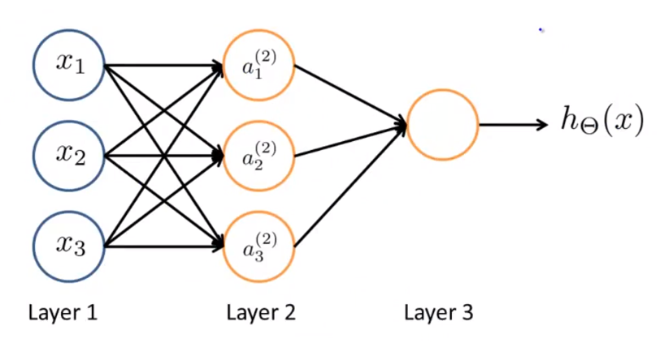

# Notes for Machine Learning on coursera

[course website](https://www.coursera.org/learn/machine-learning/)

* Definition of machine learning

    *  "the field of study that gives computers the ability to learn without being explicitly programmed."  -  Arthur Samuel

    * "A computer program is said to learn from experience E with respect to some class of tasks T and performance measure P, if its performance at tasks in T, as measured by P, improves with experience E." - Tom Mitchell

* Types of machine learning

    * Supervised learning

        * Regression problems

        * Classification problems

    * Unsupervised learning

        * Clustering

        * Non-clustering

            * Cocktail party problem

* Model Representation

    * notation

        * $m$ : Number of training examples

        * $x$'s : input variable/features

        * $y$'s : output variable/ target variable

        * $x^{(i)}$ : $i^{th}$ input

        * $y^{(i)}$ : $i^{th}$ output

        * $(x^{(i)},y^{(i)})$ : $i^{th}$ training example

    * model struct

        

        $h$ stand for hypothesis, for linear regression $h_\theta(x)=\theta_0+\theta_1 x$.

* Cost Function

    We can measure the accuracy of our hypothesis function by using a **cost function**.

    $$\min_{\theta_0,\theta_1}\!\mathrm{imize}J(\theta_0,\theta_1)$$
    <!--- $$\overset{\theta_0,\theta_1}{minimize}J(\theta_0,\theta_1)$$ --->
    $$J(\theta_1,\theta_2)=\frac{1}{2m}\sum_{i=1}^n(h_\theta(x^{(i)})-y^{(i)})^2$$
    Also called Squared error function/Mean squared error:

* Parameter learning

    * Gradient descent algorithm

        repeat until convergence {
            $\theta_j := \theta_j - \alpha \frac{\partial}{\partial \theta_j} J(\theta_0, \theta_1)$ (for $j=0$ and $j=1$)
        }

        * $\alpha$ : learning rate

            * if $\alpha$ is too small, gradient descent can be slow.

            * if $\alpha$ is too large, gradient descent can overshoot the minimum. It may fail to converge, or even diverge.

        * simultaneously  update(right implementation)

        * non-simultaneous update (wrong implementation,another algorithm)

        * Batch gradient descent

* Multivariable Linear Regression

    * notation

        * the hypothesis $h_\theta(x)=\theta_0+\theta_1 x_1 + \cdots \theta_n x_n$

        * $x_j^{(i)}$ is the $i^{th}$ input of feature $j$

        * suppose $x_0=0$
            $h_\theta(x)=\theta^T x$ where $\theta=[\theta_0, \theta_1,\cdots,\theta_n]^T$ and $x=[x_0, x_1,\cdots,x_n]^T$

    * Gradient descent

        * the cost function

            $$J(\theta)=J(\theta_0, \theta_1,\cdots,\theta_n) = \frac{1}{2m}\sum_{i=1}^n(h_\theta(x^{(i)})-y^{(i)})^2 = \frac{1}{2m}\sum_{i=1}^n(\theta^T x^{(i)}-y^{(i)})^2$$

        * algorithm
            repeat until convergence {
                $\displaystyle{\theta_j := \theta_j - \alpha \frac{\partial}{\partial \theta_j} J(\theta)}$ (for $j=0 \cdots n$)
            }

        * Feature scaling

        * Mean normalization

    * Polynomial Regression

        $$h_\theta(x)=\theta_0+\theta_1 x_1 + \theta_2 x_1^2$$

* Normal Equation

    $$\theta=(X^T X ^{-1}) X^T y$$

    * advantages and disadvantages

        | Gradient Descent           | Normal Equation                            |
        |:---------------------------|:-------------------------------------------|
        | Need to choose alpha       | No need to choose alpha                    |
        | Needs many iterations      | No need to iterate                         |
        | $O(kn^2)$                  | $O(n^3)$, need to calculate inverse of $X^TX$ |
        | Works well when n is large | Slow if n is very large                    |

    * non-invertible

        * redundant features (linearly dependent)

        * to many features

            * regularization

* Logistic Regression (Classification algorithm)

    * Hypothesis Representation

        * Want $0 \le h_\theta (x) < 1$

        * $h_\theta(x)=g(\theta^T x)$ where $\displaystyle{ g(z) = \frac{1}{1+e^{-z}}} $, $g(z)$ is called Sigmoid function or Logistic function.

        

        * $h_\theta(x)=P(y=1|x;\theta)$ means probability that $y=1$ given $x$, parameterized by $\theta$

            $P(y=0|x;\theta)=1-P(y=1|x;\theta)$

    * Decision Boundary

        * Predict $y=1$ ==> $h_\theta(x) \ge 0.5$  ==> $g(\theta^Tx) \ge 0.5$ ==> $\theta^Tx \ge 0$

        * Predict $y=0$ ==> $h_\theta(x)<0.5$  ==> $g(\theta^Tx)<0.5$ ==> $\theta^Tx<0$

        * Non-linear Decision

    * Cost Function

        * $\displaystyle{J(\theta)=\frac{1}{m}\sum_{i=1}^m Cost(h_\theta(x^{(i)}),y^{(i)})}$

        * $\displaystyle{
            Cost(h_\theta(x),y)=\begin{cases}
            -\log(h_\theta(x)) & \text{if } y=1 \\
            -\log(1-h_\theta(x)) & \text{if } y=0
            \end{cases}
            }$

        * $Cost(h_\theta(x),y)$ if $h_\theta(x)=y$
            $Cost(h_\theta(x),y) \to \infty$ if $y=0$ and $h_\theta(x) \to 1$
            $Cost(h_\theta(x),y) \to \infty$ if $y=1$ and $h_\theta(x) \to 0$

    * Gradient descent

        * write cost function as
            $Cost(h_\theta(x),y)=-y\log(h_\theta(x))-(1-y)\log(1-h_\theta(x))$

        * then
            $\displaystyle{ J(\theta)=-\frac{1}{m}\sum_{i=1}^m[y^{(i)}\log(h_\theta(x^{(i)}))-(1-y^{(i)})\log(1-h_\theta(x^{(i)}))]
                }$

            or
            $\displaystyle{ J(\theta) = -\frac{1}{m}(-y^T \log(h_\theta(x) - (1-y)^T \log(1-h_\theta(x)) }$

        * gradient descent algorithm

            repeat until convergence {
                $\displaystyle{ \theta_j := \theta_j - \alpha \frac{\partial}{\partial \theta_j} J(\theta)}$
            }

            or

            repeat until convergence {
                $\displaystyle{ \theta_j := \theta_j - \frac{\alpha}{m} \sum_{i=1}^m (h_\theta(x^{(i)}) - y^{(i)}) x^{(i)} }$
            }

            or
            $\displaystyle{ \theta_j := \theta_j - \frac{\alpha}{m} X^T ( g(X \theta ) - y) }$

    * Advanced Optimization
        * Conjugate gradient
        * BFGS
        * L-BFGS

        ```matlab
        fminunc(FCN,X0,OPTIONS)
        ```

    * Multi Classification
        One-vs-All (one-vs-rest)

        * $y \in \{0,1, \cdots ,n\}$

        * $\displaystyle{
            h_\theta^{(i)}=P(y=i|x;\theta) \text{ where } i=0,1,\cdots,n
            }$

        * $\displaystyle{ prediction=\max\limits_i(h_\theta^{(i)} (x)) }$

* The problem of overfitting

    * Underfit / High bias
    * "Just right"
    * Overfit / High variance

    * Addressing overfitting
        * Reduce number of features
            * Manually select which features to keep.
            * Use a model selection algorithm (studied later in the course).
        * Regularization
            * Keep all the features, but reduce the magnitude of parameters $\theta_j$.
            * Regularization works well when we have a lot of slightly useful features.

    * Regularized linear regression

        * cost function

            $$J(\theta) = \frac{1}{2m} \left[ \sum_{i=1}^n ( h_\theta( x^{(i)}) - y^{(i)})^2 + \lambda \sum_{j=1}^n \theta_j^2 \right] $$

            $\lambda$ is the regularization parameter.

        * gradient descent

            repeat {
                $\displaystyle{\theta_0 := \theta_0 - \alpha \frac{\partial}{\partial \theta_0} J(\theta)}$
                $\displaystyle{\theta_j := \theta_j - \alpha \frac{\partial}{\partial \theta_j} J(\theta) +\frac{\lambda}{m}\theta_j }$ (for $j=1 \cdots n$)
            }

        * Normal Equation

            $$\theta=(X^T X + \lambda \cdot L)^-1 X^T y $$
            where $L=\left[
            \begin{matrix}
            0& & & & \\
             &1& & & \\
             & &1& & \\
             & & &\ddots& \\
             & & & &1
            \end{matrix}
            \right]$

    * Regularized logistic regression

      $$J(\theta)=-\frac{1}{m} \sum_{i=1}^m [ y^{(i)} \log(h_\theta(x^{(i)})) - (1-y^{(i)}) \log(1-h_\theta(x^{(i)}))] + \frac{\lambda}{2m} \sum_{j=1}^n \theta_j^2 $$

* Neural Network

    * Model Representation
        

        * $x_0 x_1 x_2$ is called the **input layer** / layer 1

        * $h_\Theta(x)$ is the **output layer**

        * others between input and output layer is **hidden layer**

        * $a_i^{(j)}$ is activations of unit $i$ in layer $j$

            $$\left[ \begin{array}{c}  x_0 \\  x_1 \\  x_2 \\  x_3  \end{array} \right] \to
            \left[ \begin{array}{c}  a_1^{(2)} \\  a_2^{(2)} \\ a_3^{(2)}  \end{array} \right] \to
            h_\Theta(x)$$

        * $\Theta(j)$ is matrix of weights controlling function mapping from layer $j$ to layer $j+1$

            $$\begin{array}{rcl}
            a_1^{(2)} & = & g(\Theta_{10}^{(1)} x_0 + \Theta_{11}^{(1)} x_1 + \Theta_{12}^{(1)} x_2 + \Theta_{13}^{(1)} x_3) \\
            a_2^{(2)} & = & g(\Theta_{20}^{(1)} x_0 + \Theta_{21}^{(1)} x_2 + \Theta_{22}^{(1)} x_2 + \Theta_{23}^{(1)} x_3) \\
            a_3^{(2)} & = & g(\Theta_{30}^{(1)} x_0 + \Theta_{31}^{(1)} x_3 + \Theta_{32}^{(1)} x_2 + \Theta_{33}^{(1)} x_3) \\
            h_\Theta(x)=a_1^{(3)} & = & g(\Theta_{10}^{(2)} a_0^{(2)} + \Theta_{11}^{(2)} a_1^{(2)} + \Theta_{12}^{(2)} a_2^{(2)} + \Theta_{13}^{(2)} a_3^{(2)})
            \end{array}$$

        * $\Theta(j)$ is a matrix of dimension of $s_{j+1} \times (s_j+1)$, where $s_j$ is the number of nodes in layer $j$.

        * $z^{(i+1)}=\Theta^{(i)} a^{(i)}$
